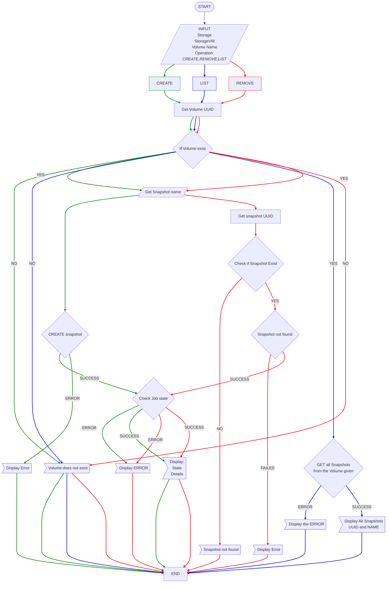

# Netapp_snapshot
This repository contains sample scripts illustrating how to use the ONTAP(NETAPP) REST API. This repository also contains a script that shows how to use Vault on ONTAP(NETAPP) REST API

# snapshot_ops

This repo contains simple program that `CREATE`, `LIST`, and `REMOVE`  NETAPP snapshots in a specific ONTAP/NETAPP storage.


### Features
- `CREATE` a snapshot
- `REMOVE` a snapshot
- Get the `LIST` of Snapshots
- Helpful CLI

### Requirements
- Python 3.6 or higher
- requests 2.21.0 or later
- ONTAP 9 (NetApp storage system) or higher (untested on earlier versions)
- Install docopt

Check [install docopt](https://pypi.org/project/docopt/) for more information

- Install PrettyTable

Check [install prettytable](https://pypi.org/project/prettytable/) for more information


### Usage Example
## Run the program


1. Creating a snapshot

```bash
snapshot_ops.py -s <STORAGE> -vm <SVM> -vn <VOLUME_NAME> --create
```

2. Remove a snapshot
```bash
snapshot_ops.py -s <STORAGE> -vm <SVM> -vn <VOLUME_NAME> --remove
```

3. GET a list of all snapshots
```bash
snapshot_ops.py -s <STORAGE> -vm <SVM> -vn <VOLUME_NAME> --list
```
    		

4. HELP
```
snapshot_ops.py -h | --help
```

5. VERSION
```
snapshot_ops.py --version
```

- [STORAGE] => name of your storage
- [STORAGE VM] => name of your SVM
- [VOLUME NAME] => name of the Volume


## Release Instructions
1. Update `CHANGELOG.md` with new version




## Support

Report any issues to: https://github.com/DMarkStorage/Netapp_snapshot/issues. For any questions or concerns and send us an [email](daminimark@gmail.com)

To learn more about ONTAP REST APIs, visit https://devnet.netapp.com/restapi.php 